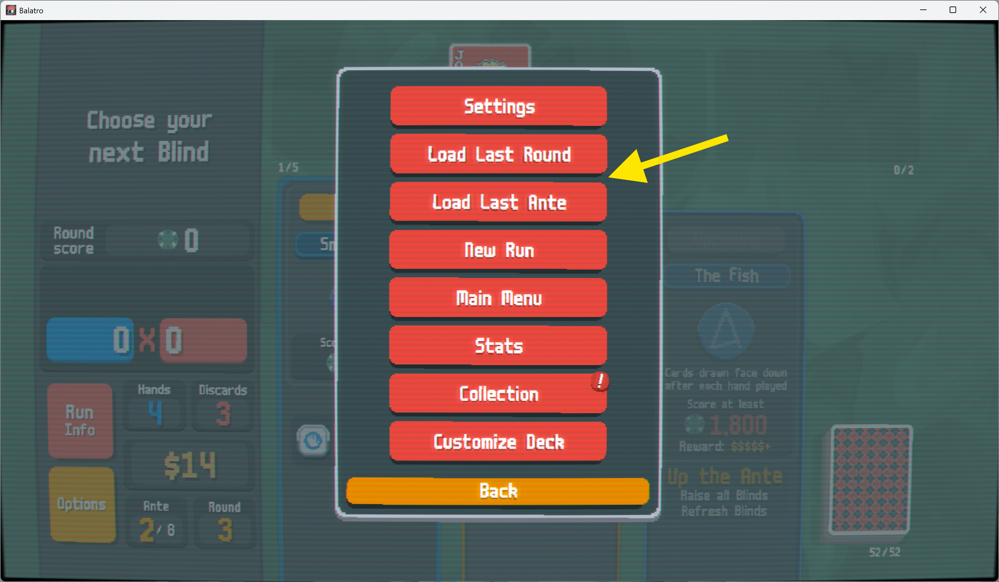

# Balatro Checkpoint Mod

A simple Balatro mod to add checkpoint functionalities.

Made a mistake by accident? Don't worry, you can reload your progress from the last round or the beginning of the last ante.

## Installation

### Manually Patch

Put `mod.lua` to the source root and rename it to `checkpoint_mod.lua`. Then add the following lines to `main.lua`:

```patch
 require "engine/text"
 require "challenges"
+require "checkpoint_mod"

 math.randomseed( G.SEED )

 function love.run()
```

### Via Lovely

If you have already installed [Lovely](https://github.com/ethangreen-dev/lovely-injector) for other mods, then it should be the best way to use this mod. Simply clone or download this repo, and put the repo directory in Lovely's mod directory.

Using Windows as an example, the correct layout should be as follows:

```
%AppData%/Balatro/Mods
├───balatro-checkpoint-mod
│       mod.lua
│       lovely.toml
│       ...
└───lovely
```

## Usage

The mod saves checkpoints automatically when you finish a round. Once there are saved checkpoints, you can load them anytime from the options menu.



## Compatibility

This mod implements its features by patching the game's functions and adding incremental logics. It doesn't perform breaking changes at the source level.

So generally, it should be compatible with any other mods.

## ⚠️ Caveats

The checkpoints are currently stored in memory only, and you will lose them if you quit the game.

## License

Licensed under MIT License, see [LICENSE](./LICENSE) for more information.